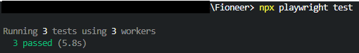
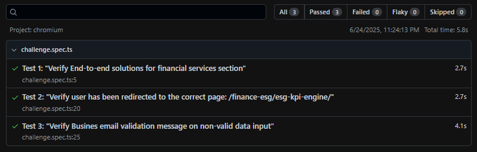

# SAP Fioneer

This repository contains demo automation testing framework for SAP Fioneer company based on Playwright and TypeScript

_In order to run tests use:_

```bash
 npx playwright test
```


There are three tests in the only spec file "challenge.spec.ts" are automated:


**Test 1: "Verify End-to-end solutions for financial services section"**

**Steps:**
1. Visit "https://www.sapfioneer.com/";
2. Verify End-to-end solutions for financial services section where test checks: 
 - title for every of three cards;
 - text, describing every of three cards;
 - image icon for every of three cards;

**Expected result:**
    1. Title of the section has correspondent text;
    2. Titles of cards are visible with respective texts;
    3. Cards descriptions are visible with respective texts;
    4. Cards have proper image icons visible;


**Test 2: "Verify user has been redirected to the correct page: /finance-esg/esg-kpi-engine/"**

**Steps:**
1. Visit "https://www.sapfioneer.com/";
2. Click Products;
3. Click Finance & ESG;
4. Click ESG KPI Engine under ESG and climate management 

**Expected result:**
    1. Current url should be: "https://www.sapfioneer.com/finance-esg/esg-kpi-engine/"
    2. Current page title should be: "Stay audit-ready with the ESG KPI Engine | SAP Fioneer"


**Test 3: "Verify Busines email validation message on non-valid data input"**

**Steps:**
1. Visit "https://www.sapfioneer.com/";
2. Click on Get in touch button
3. In contact form, for Work email (Business email in fact) field type incorrect email value

**Expected result:**
    1. Current url should be: "https://www.sapfioneer.com/contact-sales/"
    2. Verify if a user has been redirected to the correct page: Get in touch with an expert | SAP Fioneer 
    3. Email input should be underlined with red line
    4. Error message 'Email must be formatted correctly.' under email input should appear as a label
    5. Error message should be of red color


Test data is placed in the "test.data.ts" file.

_In order to see test report after tests are executed use:_

```bash
npx playwright show-report
```
HTML report will served at localhost and should look as follows:
